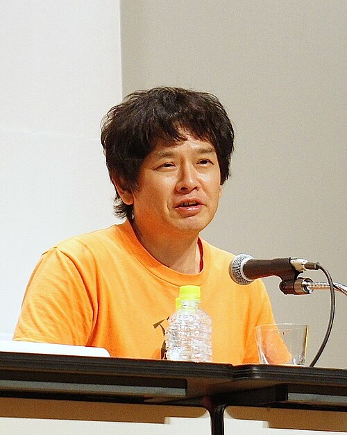

# Visual-Voices
<!DOCTYPE html>
<html lang="en">
<head>
  <meta charset="UTF-8" />
  <meta name="viewport" content="width=device-width, initial-scale=1.0" />
  <title>Visual Voices - The Sound of Art</title>
  
</head>
<body>
  <header>
    <h1>Visual Voices - The Sound of Art</h1>
    <nav>
      <a href="#nara">Yoshitomo Nara</a>
      <a href="#kusama">Yayoi Kusama</a>
      <a href="#wu">Wu Chi-Tsung</a>
    </nav>
  </header>

  <section class="section">
    

      
      

        <h2>Yoshitomo Nara</h2>
        
Yoshitomo Nara is a contemporary Japanese artist known for his depictions of solitary, rebellious children. His style blends pop culture, cartoons, and punk influences, often carrying deeper social and psychological critiques beneath a playful surface.

      

    

    

      
      

        <h2>Yayoi Kusama</h2>
        
Yayoi Kusama is one of Japan's most iconic avant-garde artists. She is renowned for her use of polka dots and mirrored installations to create infinite visual experiences. Her work often reflects themes of psychological healing, self-identity, and feminism.

      

    

    

      
      

        <h2>Wu Chi-Tsung</h2>
        
Wu Chi-Tsung is a contemporary Taiwanese artist known for his innovative use of light, shadow, and photography. His works, such as the "Cyano-Collage" series, integrate traditional Chinese ink aesthetics with modern technology, exploring time, nature, and perception.

      

    

  </section>
</body>
</html>
